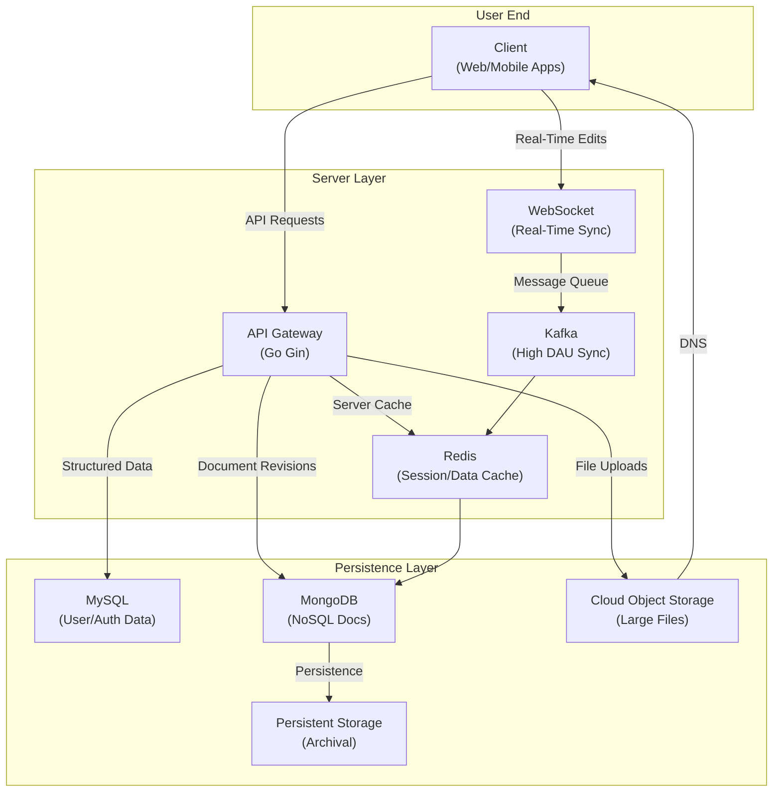
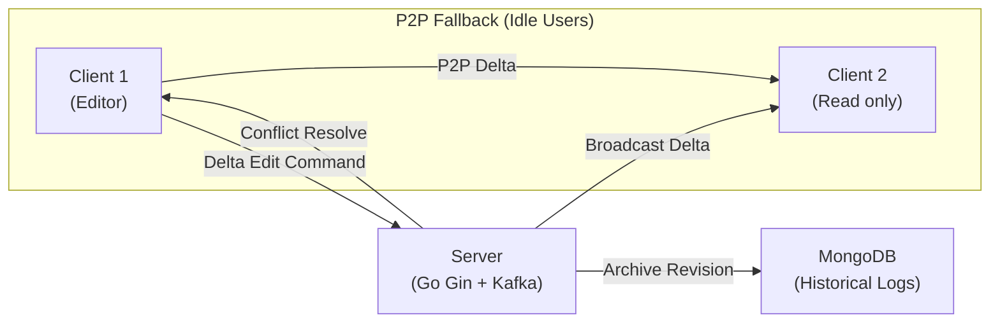

# Collaborative Document System Architecture

## High-Level Architecture Diagram



## Data Editing Architecture for High-Concurrency Sync



## Scalability Strategies
- Horizontal scaling: Shard MongoDB and Kafka clusters; use load-balanced Go Gin instances.
- Auto-scaling: Monitor DAU/metrics to dynamically add nodes via Kubernetes.

## Component Selection Reasons
- **Go (Gin)**: Chosen for high concurrency and low overhead, reducing maintenance via minimal deps.
- **MySQL**: Reliable for structured data like users/permissions; ACID compliance for consistency.
- **MongoDB**: Flexible for evolving doc schemas; sharding supports scalability and revisions.
- **Kafka**: Handles high-throughput real-time messaging for 100M DAU with persistence.
- **Cloud Object Storage**: Secure, scalable storage isolating large files from text traffic.
- **Redis**: Fast caching for low-latency sync, reducing DB hits.

## Data Models
- **MySQL (Users/Permissions)**: User {id, name, email}; Permission {doc_id, user_id, level (full/read/none), timestamp}.
- **MongoDB (Documents)**: Doc {id, content (JSON), revisions [{version, changes, timestamp}], metadata}.
- **Kafka (Messages)**: Topics for edits {doc_id, delta, user_id}; sync triggers.
- **Redis (Cache)**: Keys for sessions {user_id: permissions}; doc_deltas {doc_id: recent_changes}.
- **Cloud Object Storage (Files)**: Buckets for media {doc_id/file_id: binary}.

## Key Detail Explanations
- **Consistency in Edits**: Use CRDTs for deterministic merges, ensuring identical outcomes across clients.
- **Security**: Hash (e.g., SHA-256) all logs; encrypt transmissions with TLS.
- **Idle Handling**: Timers for mode switches (edit→read-only after 15min; read-only→P2P after 30min; disconnect after 60min).

## TDD Approach
Deploy a high-availability auto-testing system using Jenkins/Kubernetes, running tests during off-peak hours (e.g., nightly via cron). Maximize test cases (>80% coverage) with Go's testing pkg.

Build CI/CD pipeline: 
- **Version Mgmt/Release**: Git for branching; semantic versioning.
- **Func Tests**: Unit/integration tests for features (e.g., collab edits, permissions).
- **Perf Tests**: Use Go pprof for CPU/block/mem profiling;
Pipeline: Commit → Tests (TDD-first) → Build → Deploy → Monitor.

## Installation and Usage

```shell
// Adding requirements
go mod tidy
// running service
// run locally
go run ./cmd/server

// or build binary
go build -o bin/todo ./cmd/server
./bin/todo
```

API endpoints:

- `GET /todos` — list todos (query: `status`, `sort_by`, `order`)
- `POST /todos` — create
- `GET /todos/{id}` — retrieve
- `PUT /todos/{id}` — update
- `DELETE /todos/{id}` — delete

CI: see `.github/workflows/ci.yml` which runs `go build` and `go test ./...`.

Serving API docs locally

- Start the server locally:

```bash
go run ./cmd/server
```

- Open the Swagger UI at: `http://localhost:8080/swagger/index.html` which loads the bundled OpenAPI JSON at `/docs/swagger.json`.

To generate richer OpenAPI docs from code annotations, install `swag` (https://github.com/swaggo/swag) and run `swag init` in the project root; update the generated `docs` package or replace `docs/swagger.json` with the generated output.
